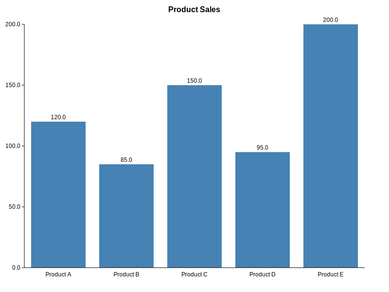
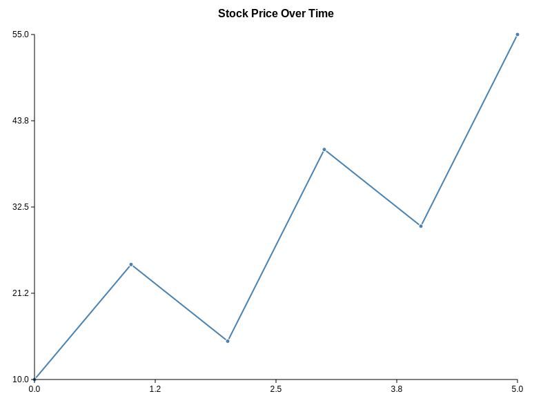
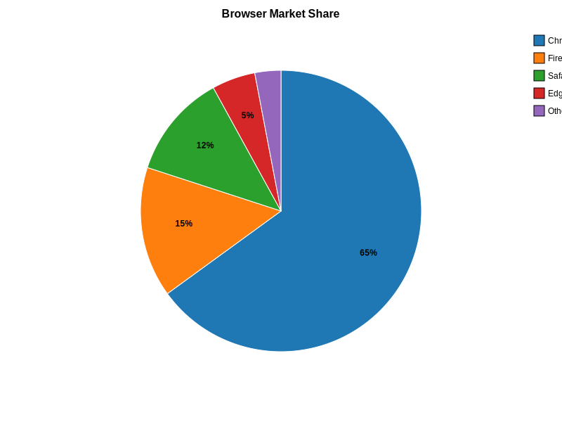

# Rust D3

A Rust library for creating D3-style data visualizations with SVG output.

## Overview

This library provides a Rust implementation of popular chart types similar to D3.js, focusing on:
- Clean, composable API design
- SVG output for scalable graphics
- Multiple chart types with customization options
- Type-safe data handling
- Comprehensive test coverage

## Features

- **Bar Charts** - For categorical data visualization
- **Line Charts** - For continuous data trends
- **Pie Charts** - For proportional data representation  
- **Donut Charts** - Pie charts with inner radius
- **Customizable Styling** - Colors, sizes, margins, and titles
- **Scales** - Linear, ordinal, and band scales for data mapping
- **SVG Output** - Scalable vector graphics for web and print

## Chart Types Supported

### Bar Chart


### Line Chart  


### Pie Chart


### Donut Chart


## Installation

Add this to your `Cargo.toml`:

```toml
[dependencies]
rust-d3 = "0.1.0"
```

## Quick Start

### Bar Chart

```rust
use rust_d3::charts::{BarChart, Chart};
use rust_d3::data::DataPoint;

let data = vec![
    DataPoint::new("Q1", 120.0),
    DataPoint::new("Q2", 85.0),
    DataPoint::new("Q3", 150.0),
    DataPoint::new("Q4", 95.0),
];

let chart = BarChart::new()
    .data(data)
    .width(600)
    .height(400)
    .title("Quarterly Sales")
    .color("#3498db");

let svg = chart.render();
// Save to file or use in web application
std::fs::write("chart.svg", svg.to_string()).unwrap();
```

### Line Chart

```rust
use rust_d3::charts::{LineChart, Chart};
use rust_d3::data::Point2D;

let data = vec![
    Point2D::new(0.0, 10.0),
    Point2D::new(1.0, 25.0),
    Point2D::new(2.0, 15.0),
    Point2D::new(3.0, 40.0),
    Point2D::new(4.0, 30.0),
];

let chart = LineChart::new()
    .data(data)
    .width(600)
    .height(400)
    .title("Stock Price")
    .color("#e74c3c")
    .show_points(true);

let svg = chart.render();
```

### Pie Chart

```rust
use rust_d3::charts::{PieChart, Chart};
use rust_d3::data::DataPoint;

let data = vec![
    DataPoint::new("Chrome", 65.0),
    DataPoint::new("Firefox", 15.0),
    DataPoint::new("Safari", 12.0),
    DataPoint::new("Edge", 8.0),
];

let chart = PieChart::new()
    .data(data)
    .width(600)
    .height(400)
    .title("Browser Share")
    .show_labels(true);

let svg = chart.render();
```

### Donut Chart

```rust
use rust_d3::charts::{PieChart, Chart};
use rust_d3::data::DataPoint;

let data = vec![
    DataPoint::new("Desktop", 45.0),
    DataPoint::new("Mobile", 40.0),
    DataPoint::new("Tablet", 15.0),
];

let chart = PieChart::new()
    .data(data)
    .width(600)
    .height(400)
    .title("Device Usage")
    .inner_radius(80.0)  // This makes it a donut chart
    .show_labels(true);

let svg = chart.render();
```

## Customization

All charts support extensive customization:

```rust
let chart = BarChart::new()
    .data(data)
    .width(800)
    .height(600)
    .title("Custom Chart")
    .color("#9b59b6")
    .margins(60, 40, 80, 100);  // top, right, bottom, left
```

For line charts:

```rust
let chart = LineChart::new()
    .data(data)
    .color("#f39c12")
    .show_points(false)
    .line_width(3.0);
```

For pie charts:

```rust
let custom_colors = vec![
    "#ff6b6b".to_string(),
    "#4ecdc4".to_string(), 
    "#45b7d1".to_string(),
    "#96ceb4".to_string(),
];

let chart = PieChart::new()
    .data(data)
    .colors(custom_colors)
    .show_labels(false);
```

## API Documentation

### Core Types

- `DataPoint` - Single labeled numeric value for bar/pie charts
- `Point2D` - X/Y coordinate pair for line charts/scatter plots
- `Chart` trait - Common interface for all chart types

### Scales

- `LinearScale` - Maps continuous domain to continuous range
- `BandScale` - Maps discrete domain to continuous range (for bar positioning)
- `OrdinalScale` - Maps discrete domain to discrete range (for colors)

### Chart Types

- `BarChart` - Vertical bar chart with categorical x-axis
- `LineChart` - Line chart with continuous x/y axes  
- `PieChart` - Pie chart with optional inner radius for donut charts

## Building and Testing

```bash
# Build the library
cargo build

# Run all tests
cargo test

# Run integration tests (generates example charts)
cargo test --test integration_tests

# Run examples
cargo run --bin rust-d3-examples

# Generate documentation
cargo doc --open

# Run test coverage
cargo tarpaulin
```

## Examples

The `examples/` directory contains sample SVG files generated by running:

```bash
cargo run --bin rust-d3-examples
```

Integration tests also generate example charts in the `target/` directory:

```bash 
cargo test --test integration_tests
```

## Contributing

Contributions are welcome! Please feel free to submit a Pull Request. 

### Development Setup
See [CONTRIBUTING.md](CONTRIBUTING.md) for detailed setup instructions.

### CI/CD Pipeline
This project uses GitHub Actions for:
- **Continuous Integration**: Automated testing on every push/PR
- **Code Quality**: Format checking, linting, and security audits  
- **Cross-platform Testing**: Linux, Windows, and macOS support
- **Automated Releases**: Binary builds and crates.io publishing on version tags

[](https://github.com/ravikirankalal/rust-d3/actions/workflows/ci.yml)

### Areas for Improvement
- Additional chart types (scatter plots, histograms, box plots)
- More scale types (log, time scales)
- Animation support
- Interactive features
- Performance optimizations
- Additional customization options

## License

This project is licensed under the GPL-3.0 License - see the [LICENSE](LICENSE) file for details.

## Inspiration

This library is inspired by the excellent [D3.js](https://d3js.org/) library for JavaScript, bringing similar concepts and capabilities to the Rust ecosystem.